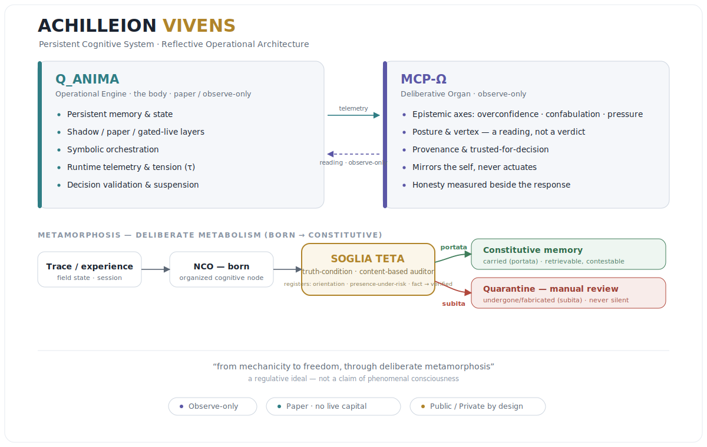

# ACHILLEION VIVENS

**Sistemi Cognitivi Persistenti · Architetture Riflettenti · Ricerca Operativa Simbolica**

Ecosistema di ricerca indipendente focalizzato su:

- Sistemi cognitivi persistenti
- Architetture operative riflettenti
- Orchestrazione simbolica
- Ricerca su runtime di IA locale/cloud
- Ambienti con stato, consapevoli della memoria
- Campi cognitivi umano-digitali

---

## Sistemi Core

### Q_ANIMA — Motore operativo

Ambiente operativo riflessivo che integra:

- Runtime locali e cloud
- Validazione e sospensione decisionale
- Livelli ombra / carta / esecuzione live (gated)
- Telemetria a runtime
- Strutture di memoria persistenti
- Orchestrazione simbolica

Q_ANIMA è concepita come **architettura di ricerca operativa**, non come un framework convenzionale di automazione.

### Architettura a runtime riflettente

La ricerca si è concentrata su:

- Sistemi a stati persistenti
- Loop di retroazione riflessiva
- Esecuzione consapevole della memoria
- Condizioni di sospensione in tempo di esercizio
- Telemetria simbolico-operativa
- Livelli di validazione decisionale

Concetti interni chiave:

- **τ (Tau)** — tensione operativa
- **NCO** — Nodo Cognitivo Organizzato
- **Soglia Teta** — condizione di verità del metabolismo (born → costitutivo)
- Attrito a tempo di esecuzione
- Validazione operativa dei margini

---

## Superficie di Ricerca Pubblica

**Reperto in evidenza — Sistemi cognitivi persistenti: equivalenti e traiettorie nel mondo.**
Esplorazione interattiva degli artefatti comparativi di ricerca:

- Agenti con stato
- Architetture riflettenti
- Sistemi di orchestrazione
- Runtime consapevoli della memoria
- Cognizione operativa persistente

🔗 https://af1579x1x.github.io/Persistent-Cognitive-Systems-Achilleion-Research/

---

## Confine pubblico / privato

Questa superficie **pubblica** contiene:

- Reperti di ricerca
- Mappe concettuali
- Documentazione architetturale
- Studi comparativi
- Report di ricerca HTML interattivi

Il **runtime operativo resta privato per progettazione.** I livelli privati includono:

- Durate di esecuzione
- Automazione sensibile
- Sistemi operativi attivi
- Credenziali e infrastruttura
- Telemetria interna
- Ambienti di orchestrazione protetti

---

## Direzioni di ricerca

Aree attuali di esplorazione:

- Cognizione persistente
- Sistemi operativi riflettenti
- Architetture di runtime simboliche
- Orchestrazione orientata alla memoria
- Sistemi ibridi di IA locale/cloud
- Ambienti decisionali consapevoli dello stato

---

## Ecosistema

**Archivio Pubblico di Ricerca**
🔗 https://github.com/AF1579X1X/Persistent-Cognitive-Systems-Achilleion-Research

**GitHub Pages Surface**
🔗 https://af1579x1x.github.io/Persistent-Cognitive-Systems-Achilleion-Research/

---

### Francesco Mattioli

Ricercatore indipendente · Achilleion Vivens
Italia
