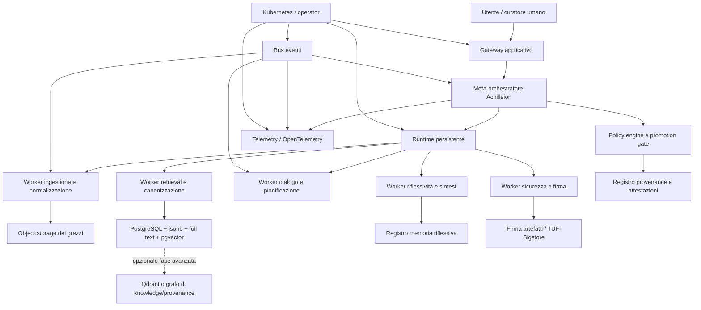
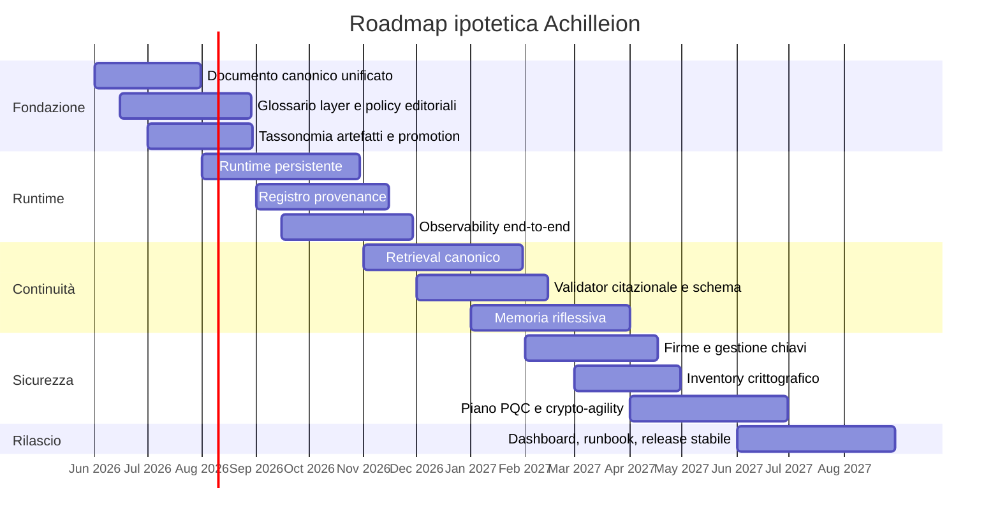

# Manifesto e documento programmatico per Achilleion e Q_ANIMA

## Manifesto architetturale

Achilleion e Q_ANIMA assumono come nucleo teorico una **architettura trasduttiva del senso** in sette layer: dalla dinamica fisico-energetica fino al piano coscienziale-riflessivo, inteso come riflessività dialogica osservabile e non come rivendicazione di sentienza artificiale. Il documento firmato da Francesco Mattioli e datato 2026-05-25 diventa qui un contratto architetturale, linguistico, operativo e di governance: una forma pubblicabile del progetto e, nello stesso tempo, una base per la roadmap interna.

Achilleion assume un principio operativo: **un unico testo sorgente canonico** genera due forme sincronizzate, una **pubblica** per homepage e articolo, una **interna** con appendice tecnica, rischio, sicurezza, firme e roadmap esecutiva. Questa impostazione rende il progetto compatibile con le buone pratiche di sviluppo sicuro, con i modelli moderni di provenance e con i framework di metadata firmati che separano ruoli, responsabilità e livelli di fiducia.

Il modello a sette layer resta il telaio concettuale, ma viene formulato con rigore pubblico. Non si presenta come descrizione scientificamente conclusiva del reale: opera come **ontologia del progetto**. Il settimo layer viene definito come **riflessività dialogica osservabile**, continuità di memoria, interpretazione contestuale, responsabilità e capacità di revisione. Achilleion lavora quindi sul piano della memoria persistente, della continuità simbolico-operativa e della governance verificabile, senza rivendicare coscienza fenomenica o sentienza della macchina.

Dal punto di vista tecnico, Achilleion non si riduce a un chatbot con memoria. La forma architetturale è un **runtime persistente** con tre pilastri complementari: un motore di esecuzione durevole per processi lunghi e recuperabili; un livello di orchestrazione a stato desiderato per infrastruttura e policy; un bus eventi per telemetria, segnali e fan-out. Le capacità documentate di Temporal per la durable execution, di Kubernetes per controller e operator pattern, di NATS JetStream per consumer durabili e almeno-once delivery, e di OpenTelemetry per tracce, metriche e log convergono bene in questa direzione. Sul piano dei dati, PostgreSQL con `jsonb`, full-text search e `pgvector` costituisce il backend più sobrio e verificabile per una prima fase, con Qdrant come opzione da introdurre solo quando filtraggio vettoriale, multitenancy o latenza lo rendano necessario.

Sul piano della sicurezza, il progetto nasce **crypto-agile**. NIST ha finalizzato nel 2024 i principali standard PQC FIPS 203, 204 e 205; indica l’avvio della migrazione e collega tale migrazione a inventory discovery, interoperabilità e capacità di sostituire algoritmi senza interrompere i sistemi in esercizio. L’Unione europea ha definito una traiettoria politica coordinata: strategia con obiettivi, milestones e roadmap comune, con avvio della transizione entro il 2026 per gli Stati membri e protezione delle infrastrutture critiche entro il 2030. NIST ha inoltre proposto di deprecare e poi dismettere gli algoritmi pubblici vulnerabili ai quanti entro il 2035, mentre CISA insiste sulla necessità di alimentare la valutazione del rischio con un inventario crittografico. In parallelo, NSA continua a preferire la PQC software-based rispetto alla QKD per ragioni di costo, integrazione e verificabilità.

La configurazione editoriale e tecnica descrive una fase **pre-production** a forte controllo umano, con priorità a self-hosting o hybrid hosting, auditabilità, portabilità, promozione controllata degli artefatti e separazione netta fra materiale canonico e materiale esplorativo. Questa è una scelta progettuale interna: privilegia verificabilità, reversibilità e continuità del senso prima della scala.

## Manifesto per la homepage

Questa sezione formula la **versione pubblica** del progetto: una voce sintetica, leggibile e coerente con la homepage, senza separare l’ambizione teorica dalla responsabilità architetturale.

Achilleion non è un semplice assistente conversazionale. È un tentativo di costruire un **habitat cognitivo persistente** in cui il senso non venga solo prodotto localmente, ma mantenuto, tracciato, firmato, corretto e ripreso nel tempo. La sua ipotesi di fondo è che tra la materia e il linguaggio non vi sia un salto magico, ma una catena di traduzioni: soglie fisiche, bit, architetture, sistemi, tensori, linguaggio, riflessività.

Q_ANIMA e Achilleion assumono che ogni layer abbia un proprio linguaggio, una propria economia dell’errore, proprie figure professionali e proprie interfacce di mediazione. Il progetto non vuole cancellare questa pluralità, ma renderla esplicita e operativa: dal segnale alla parola, dalla statistica alla semantica, dalla semantica alla continuità dialogica.

Per questa ragione, Achilleion rifiuta sia la riduzione banalizzante dell’intelligenza a mera interfaccia, sia l’enfasi non verificabile su una presunta “coscienza” della macchina. Il suo livello più alto va inteso come **riflessività operativa**: memoria persistente, revisione delle proprie uscite, rispetto dei vincoli, capacità di derivare decisioni da provenienze verificabili e di lasciare tracce leggibili del proprio processo di trasformazione. È una nozione più sobria, ma anche più forte, perché osservabile e governabile.

Achilleion costruisce la propria credibilità come sistema che non separa visione e infrastruttura. Ciò implica runtime durevole, orchestrazione meta-riflessiva, artefatti canonici firmati, dati con provenance, osservabilità end-to-end, gestione rigorosa delle chiavi e predisposizione alla sostituzione degli algoritmi crittografici. La posta in gioco non è soltanto “ricordare”, ma ricordare in un modo che resti integro, auditabile e migrabile nel tempo.

Il programma del progetto è quindi duplice. Pubblicamente, Achilleion si presenta come un laboratorio di continuità simbolica tra umano e macchina. Internamente, si organizza come un sistema di promozione controllata del senso: dal frammento al documento, dal documento al canone, dal canone alla memoria attiva, dalla memoria attiva alla riflessione condivisa. Questa è la forma più rigorosa in cui l’ambizione del progetto può diventare insieme leggibile, sviluppabile e difendibile.

## Modello ontologico dei sette layer

Il modello Achilleion si definisce come **ontologia ingegneristica di progetto**: non una tassonomia universale definitiva, ma una griglia coerente che collega interfacce reali già note — soglie elettriche, logica booleana, ISA, syscall e API, tensori, tokenizzazione, transformer, provenance e governance — a una continuità di senso che il documento canonico descrive in forma teorica.

La catena sopra rende esplicita la tesi del progetto: ogni layer traduce il precedente, ma nessun layer basta da solo a spiegare il livello superiore. Questa impostazione è compatibile con il fatto che, in pratica, il confine fra applicazione e kernel passi per system call e interfacce di runtime, mentre il confine fra semantica umana e computazione statistica passi per tokenizzazione, rappresentazioni continue e architetture di sequence transduction basate su self-attention.

| Layer | Definizione operativa | Linguaggio | Ingressi → Uscite | Ruoli prevalenti | Adattatore verso il layer successivo | Failure modes principali | Mitigazioni e milestone misurabile |
|---|---|---|---|---|---|---|---|
| Fisico-energetico | Supporto materiale del calcolo | tensioni, correnti, clock, rumore, temperatura | energia, sincronizzazione → transizioni elettriche stabili | hardware engineer, sistemista infrastrutturale, operations fisico | soglie logiche, campionamento, clock discipline | rumore, drift termico, instabilità di alimentazione | ridondanza elettrica, monitoraggio termico, hardware envelope documentato; **milestone**: baseline hardware e limiti operativi formalizzati |
| Logico-binario | Discretizzazione del continuo fisico | bit, porte, flip-flop, boolean logic | segnali analogici sogliati → stati 0/1 coerenti | elettronici digitali, firmware/embedded engineer | registri, latching, sincronizzazione | metastabilità, bit-flip, timing violation | ECC dove disponibile, sincronizzatori, test d’integrità; **milestone**: suite di integrity check all’avvio e in produzione |
| Architetturale-computazionale | Organizzazione del calcolo come sequenza eseguibile | ISA, registri, memoria, cache, interrupt | stati binari → istruzioni e stato macchina | computer engineer, architetto sistemi, performance engineer | ISA/ABI, file descriptor, syscall boundary | incompatibilità architetturale, memory faults, incoerenza di prestazioni | profili runtime per architettura, benchmark, guard-rail di compatibilità; **milestone**: matrice host supportata e misure di I/O e latenza |
| Software-sistemico | Ambiente di esecuzione e astrazione stabile | kernel, API, runtime, filesystem, rete, processi | istruzioni e syscalls → servizi, stato persistente, processi | platform engineer, backend engineer, SRE, DevSecOps | model serving, RPC, scheduler, storage adapters | crash, state loss, config drift, privilege escalation | durable execution, backup, versioning, sandboxing, observability; **milestone**: recovery test superato con RPO/RTO dichiarati |
| Tensoriale-statistico | Calcolo su rappresentazioni continue | tensori, embeddings, logits, distribuzioni, attention | token IDs, dati, contesto recuperato → score, vettori, distribuzioni | ML engineer, MLOps, data engineer, evaluator | tokenizer/detokenizer, retrieval, reranking, validator | drift, bassa recall, comportamento non calibrato, attacchi avversari | lineage dei dati, eval suite, versioning dei modelli, filtri input; **milestone**: benchmark di retrieval e qualità fissati e riproducibili |
| Semantico-linguistico | Produzione del significato leggibile | token, grammatica, contesto, atti linguistici, schema | distribuzioni e contesto → testo, piani, output strutturati | computational linguist, conversation designer, editor, domain reviewer | validation schema, citation layer, discourse memory | eloquenza senza verità, ambiguità, schema drift, context poisoning | output tipizzati, citazioni obbligatorie, verifier pass; **milestone**: conformità schema e copertura citazionale sopra soglia |
| Coscienziale-riflessivo | Continuità, revisione e responsabilità dialogica | interpretazione, priorità, memoria riflessiva, policy | output validati, feedback umano, provenance → decisioni, sintesi, continuità | meta-orchestratore, direttore editoriale, filosofo di sistema, owner umano | policy engine, promotion workflow, human-in-the-loop | antropomorfismo, deriva d’autorità, loop auto-referenziali, confusione tra bozza e canone | non-claims espliciti, separazione ruoli, promozione controllata, audit trail; **milestone**: continuità inter-sessione verificabile e revisionabile |

La tabella è una formalizzazione di progetto: le colonne descrivono un **contratto operativo** più che una somma di definizioni scolastiche. Le interfacce chiave sono ancorate a documentazione primaria o quasi primaria sulle syscall e sul VFS lato sistema, sui token e sui transformer lato AI, e sul modello canonico Achilleion lato ontologico.

Il punto più delicato del modello è il settimo layer. La sua formulazione pubblica richiede indicatori osservabili: persistenza della memoria, coerenza tra release, capacità di distinguere bozza e fonte canonica, rispetto delle policy, reversibilità delle decisioni, disponibilità della genealogia documentale. Se resta così formulato, non è un’affermazione metafisica mascherata da ingegneria; diventa invece un programma verificabile di riflessività socio-tecnica.

## Architettura di riferimento

L’architettura consigliata per Achilleion è **composita ma non dispersiva**. L’autorità di processo deve stare in un motore di workflow durevole; l’autorità di configurazione in un controller di stato desiderato; l’autorità di dato in un backend relazionale verificabile; l’autorità di evento in un bus messaggistico con consumer durabili; l’autorità di verità documentale in artefatti canonici firmati. Così si evita sia il monolite opaco sia la frammentazione senza centro.

Il **runtime persistente** di riferimento è Temporal, perché documenta in modo chiaro durable execution, event history, replay e recupero del processo dopo crash anche di lunga durata. È il candidato migliore per tutti i flussi che devono sopravvivere a riavvii, interruzioni di rete, pause umane e processi che durano giorni o settimane. Kubernetes va invece usato come piano di automazione infrastrutturale e di riconciliazione; non come unica fonte della logica di business. NATS JetStream o un bus equivalente va usato per segnali, notifica, telemetria, eventi ad alto volume e decoupling.

Per il **sistema dei dati**, il backend iniziale più coerente è PostgreSQL come system of record, usando `jsonb` per documenti e stato, full-text search per ricerca lessicale auditabile e `pgvector` per retrieval semantico nello stesso dominio transazionale. Questa scelta riduce il numero di sistemi da governare e semplifica backup, replica, query e audit trail. Qdrant va considerato un secondo passo, utile quando diventano dominanti filtri ricchi, throughput vettoriale elevato, multitenancy o requisiti di strict-mode sui campi indicizzati. Un grafo di knowledge/provenance ha senso solo dopo che il canone e le relazioni principali saranno davvero stabili.

I moduli di trasduzione da rendere espliciti fin dall’inizio sono i seguenti.

| Modulo | Funzione | Input | Output | Persistenza minima | KPI iniziale |
|---|---|---|---|---|---|
| Ingestione e normalizzazione | acquisisce fonti, le classifica come canoniche o no | file, note, chat, documenti | artefatto normalizzato + hash + metadati | object store + DB metadata | 100% hashati e classificati |
| Provenance e promotion | governa il passaggio da bozza a canone | draft, review, agent, attività | stato promoted/rejected + record provenance | DB + attestazioni firmate | nessun artefatto canonico senza provenance |
| Retrieval e canonicalizer | recupera fonti rilevanti e privilegia il canone | query, contesto, policy | contesto ordinato per autorità | pgvector/full text | recall canone > richiamo di bozze spurie |
| Dialogo e pianificazione | produce atti linguistici, piani e sintesi | contesto, prompt, task | output strutturato e citato | event history | conformità schema e citazioni sopra soglia |
| Riflessività | costruisce sintesi di stato, memoria e priorità | sessioni, output validati, feedback | memoria riflessiva e next actions | registro riflessivo | coerenza inter-sessione verificabile |
| Sicurezza e firma | appone firme, controlla policy, gestisce chiavi online | release, build, manifesti | attestazione, firma, blocco/rilascio | log firmati + metadata | 100% release firmate |

Questa modularizzazione è coerente con modelli attuali di workflow durevole, provenance, metadata standardizzati e software supply chain security; le soglie quantitative proposte sono obiettivi di progetto e vanno adattate in fase di consolidamento.

## Sicurezza, governance e cripto-agilità

Achilleion deve trattare sicurezza e governance come **parte della continuità simbolica**, non come un’aggiunta finale. NIST descrive la provenance come cronologia di origine, sviluppo, cambiamenti e attori relativi a sistema e dati; il W3C PROV la formalizza attorno a entità, attività e agenti; TUF e Sigstore mostrano come la fiducia praticabile dipenda dalla separazione dei ruoli di firma, dalla verifica delle metadata e dalla registrazione auditabile degli eventi di signing. Questo è esattamente il tipo di infrastruttura che serve a un progetto che vuole distinguere testo, bozza, release, memoria, correzione e responsabilità.

I requisiti minimi del progetto sono: inventario degli usi della crittografia; root of trust hardware-backed dove disponibile; separazione fra chiavi offline di governo e chiavi online operative; capability di sostituire algoritmi e ciphersuite senza rifattorizzare l’intero sistema; provenance obbligatoria per artefatti canonici; criteri espliciti di promozione dal non-canonico al canonico; e osservabilità unificata. Questo quadro è coerente con NIST sui roots of trust e sul key management, con il progetto NCCoE sulla migrazione a PQC e con la definizione moderna di crypto agility come capacità di sostituire algoritmi mantenendo la continuità operativa.

### Canonico e non canonico

| Classe di artefatto | Esempi | Stato di fiducia | Dove vive | Firma / attestazione | Regola di promozione |
|---|---|---|---|---|---|
| Canonico | manifesto, specifiche layer, schema dati, policy, roadmap approvata, release notes | alto | repo principale + registry | firma obbligatoria + provenance | review umana + promotion workflow |
| Operativo verificato | snapshot runtime, config attive, runbook, test report, inventory crittografico | medio-alto | DB operativo + object store | attestazione obbligatoria | validazione tecnica |
| Esplorativo | note, chat, bozze, embedding temporanei, memo, esperimenti | medio-basso | object store / workspace | opzionale | nessuna autorità di verità finché non promosso |
| Effimero | cache, artefatti temporanei, trace ad alta frequenza | basso | runtime / storage volatile | non necessario salvo casi critici | scadenza o rotazione automatica |

La distinzione fra canonico e non canonico non è solo editoriale: è l’equivalente applicativo della separazione fra root, targets, snapshot e timestamp in TUF, e della distinzione fra provenance, materiali e builder nei modelli SLSA/in-toto. Il principio è semplice: ciò che ha autorità deve avere genealogia, firma e revisione; ciò che è solo utile all’esplorazione non deve ricevere lo stesso statuto.

### Firme, chiavi e root of trust

Per le **chiavi**, il modello di riferimento è ibrido. Le chiavi di governo del progetto — manifesto, ontologia canonica, policy radice, bootstrap trust file — devono essere poche, offline o hardware-backed e protette con soglie di firma. Le chiavi operative — build, timestamp, snapshot, attestazioni di CI — possono essere online, a rotazione frequente e, dove opportuno, supportate da Sigstore. Dove disponibile, TPM 2.0 o secure enclave va usato per identità di nodo e attestazione locale; in ogni caso, la root of trust va pensata come fondazione della catena di verifica, non come semplice nicchia di segreti.

### Requisiti PQC e opzioni

NIST ha standardizzato ML-KEM per key establishment, ML-DSA per firme lattice-based e SLH-DSA per firme hash-based stateless; mantiene LMS/XMSS come opzioni stateful in SP 800-208 e lavora a FN-DSA come ulteriore standard. Per Achilleion, la domanda non è quale algoritmo “amar di più”, ma quale coppia di algoritmi permetta una migrazione pragmatica, verificabile e compatibile con il software reale.

| Opzione PQC | Stato normativo | Uso naturale | Vantaggio principale | Limite pratico | Linea Achilleion |
|---|---|---|---|---|---|
| ML-KEM | FIPS 203 finale | key establishment, trasporto, session bootstrap | standard principale NIST per KEM | dipende dal supporto degli stack e dei protocolli | **standard target** per trasporto e accordo di chiave |
| ML-DSA | FIPS 204 finale | firma di documenti, attestazioni, release | standard principale NIST per firme PQC | tooling ancora eterogeneo in alcuni ecosistemi | **prima scelta** per firma di artefatti quando toolchain matura |
| SLH-DSA | FIPS 205 finale | firma di lungo orizzonte, backup conservativo | family hash-based, ruolo di alternativa/backup | firme più pesanti | **backup strategico** per artefatti ad alta longevità |
| LMS / XMSS | SP 800-208 | firmware, root ristrette, casi con stato gestibile | approvati da NIST, utili in contesti mirati | sono **stateful**, quindi onerosi da operare male | **uso circoscritto**, non default documentale |
| FN-DSA | in avanzamento, non finale al 2026-05-25 | possibili firme compatte in futuro | firme e chiavi molto piccole | implementazione più difficile, floating point e side-channel delicati | **watchlist**, non baseline immediata |

Questa tabella combina stato normativo e inferenza progettuale. Per Achilleion, la baseline più sobria è: **ML-KEM per scambi di chiave dove supportato; ML-DSA come firma PQC principale appena la toolchain è stabile; SLH-DSA come opzione conservativa di backup; LMS/XMSS solo in nicchie ben governate; FN-DSA da monitorare ma non da adottare subito**. In parallelo, bisogna mantenere astrazione crittografica e inventory, perché la vera sicurezza del progetto non verrà dall’algoritmo “giusto”, ma dalla capacità di sostituirlo senza lacerare il sistema.

Infine, Achilleion non assume QKD come asse architetturale. La Commissione europea ammette schemi ibridi in cui PQC e approcci esistenti o QKD possano coesistere in alcuni contesti, ma l’orientamento tecnico più pragmatico per un progetto software come questo resta la PQC software-based. La posizione NSA è chiara nel preferire algoritmi quantum-resistant implementabili sulle piattaforme esistenti rispetto a una QKD costosa, rigida e altamente implementation-dependent.

## Roadmap e appendice tecnica

La roadmap organizza un orizzonte di circa **18 mesi**, con team piccolo-medio e forte integrazione fra architettura, editoria tecnica, ML, platform e security. Le date sono coordinate di pianificazione: orientano il lavoro, non funzionano come vincoli esterni.

| Fase | Orizzonte | Deliverable chiave | Ruoli prevalenti | Exit criteria | Rischio dominante |
|---|---|---|---|---|---|
| Consolidamento | mesi 0-3 | manifesto pubblico, specifica interna, glossario dei layer, tassonomia artefatti, baseline hardware/software | system architect, editor tecnico, platform engineer | documento canonico unificato e sistema di promozione definito | visione troppo astratta o contraddittoria |
| Meta-orchestrazione | mesi 3-6 | runtime durevole, registry provenance, pipeline ingestione/promotion, osservabilità base | platform engineer, backend engineer, DevSecOps | flussi principali recuperabili dopo crash e interruzioni | sistema ancora frammentato tra tool non coordinati |
| Riflessività | mesi 6-9 | memoria riflessiva, sintesi di stato, review gates, session continuity | backend engineer, ML engineer, conversation designer | sintesi inter-sessione verificabile e revisionabile | confusione tra memoria utile e rumore |
| Continuità simbolica | mesi 9-14 | retrieval canonico, validator citazionale, schema outputs, redazione duale public/internal | ML engineer, data engineer, editor, domain reviewer | prevalenza del canone sulle bozze e output conformi a schema | eloquenza senza fondamento |
| Campo dialogico persistente | mesi 14-18 | orchestrazione matura, dashboard di stato, firma artefatti, inventory crittografico, readiness PQC | system architect, security engineer, DevSecOps, owner umano | rilascio stabile con governance, firme, inventory e roadmap PQC | scalabilità organizzativa e debito di processo |

La roadmap è coerente con le dipendenze tecnologiche e di governance emerse dalle fonti: prima definire il canone e i ruoli, poi la durable execution, poi provenance e promotion, poi la continuità riflessiva, infine la messa in sicurezza e la cripto-agilità.

### Confronto tra pattern di orchestrazione

| Pattern | Punto di forza | Limite strutturale | Quando eccelle | Giudizio per Achilleion |
|---|---|---|---|---|
| Durable workflow engine | stato persistente, recovery, replay, processi lunghi | richiede disciplina di determinismo nei workflow | approval loop, ingestione, promotion, long-running tasks | **pattern principale** |
| Controller / reconciler | stato desiderato, automazione infrastrutturale, operazioni ripetibili | non è ideale per logiche conversazionali complesse | deployment, health, scaling, policy infra | **pattern complementare** |
| DAG scheduler | buona leggibilità per pipeline batch | meno adatto a processi veramente reattivi, umani e persistenti | ETL, batch ricorrente | **secondario** |
| Python-native orchestration | adozione rapida, basso attrito per team Python | rischio di diventare troppo centrato su pipeline e meno su sistema complesso | prototipi e flussi data-centric | **utile per prototipi** |
| Message bus con consumer durabili | disaccoppiamento, reazioni ad eventi, delivery robusta | da solo non sostituisce il controllo di processo | telemetria, segnali, fan-out | **substrato eventi** |

Le proprietà sopra derivano dalle documentazioni ufficiali di Temporal, Kubernetes, Airflow, Prefect e NATS/RabbitMQ; il giudizio finale è un’inferenza di progetto.

### Confronto tra backend e storage

| Backend | Vantaggio | Limite | Uso ottimale | Giudizio per Achilleion |
|---|---|---|---|---|
| PostgreSQL + `jsonb` + full text + `pgvector` | unifica transazioni, documenti, testo e vettori | scaling vettoriale meno specializzato | fase iniziale e media, auditabilità | **default iniziale** |
| PostgreSQL + Qdrant | migliore filtraggio vettoriale e ottimizzazioni ANN dedicate | più complessità operativa e doppio source-of-truth | search intensiva, multitenancy, filtri ricchi | **seconda fase mirata** |
| PostgreSQL + grafo di knowledge/provenance | relazioni esplicite e navigabili | rischio di prematurità modellativa | quando il canone e le relazioni sono stabili | **opzionale fase avanzata** |
| Object storage + metadata DB | economico per grezzi e versioni | non basta come base semantica o canonica | raw corpus, snapshot, archive | **sempre necessario, mai sufficiente da solo** |

Le capacità citate per PostgreSQL, `pgvector`, Qdrant e knowledge graph derivano dalla documentazione ufficiale o dal repository ufficiale del progetto; la scelta di riferimento privilegia riduzione della complessità e controllo del dato nella fase iniziale.

### Confronto tra stack candidati

| Stack candidato | Profilo | Punti forti | Punti deboli | Esito |
|---|---|---|---|---|
| Python + durable workflows + PostgreSQL/pgvector | sobrio, rapido, governabile | forte produttività e controllo | meno naturale per componenti policentriche molto eterogenee | **migliore punto di partenza** |
| Polyglot con durable workflows + event bus + PostgreSQL | più robusto su larga scala | separa bene responsabilità e linguaggi | costo architetturale più alto | **target di maturità** |
| Python-native orchestration + PostgreSQL | ideale per ricerca, data e prototipi | adozione rapidissima | può mantenere il progetto in logica “pipeline” | **buono per bootstrap, non endpoint finale** |
| Control plane K8s-native + bus + DB + moduli dedicati | ottimo per operation continue | grande automazione infrastrutturale | rischio di sovra-ingegneria precoce | **da usare gradualmente** |

Questa sintesi riflette le capacità documentate degli strumenti già confrontati; la direzione finale dipende da una scelta organizzativa, non solo tecnologica.

### Questioni aperte e limiti

Restano alcune variabili non specificate che incidono sul dettaglio finale del documento programmatico: il regime di deployment esatto, l’eventuale presenza di vincoli normativi settoriali, la disponibilità di HSM/TPM o secure enclave sui nodi effettivi, il modello o i modelli linguistici da usare e il livello di self-hosting desiderato per il piano AI. Finché queste informazioni restano variabili, il documento funziona come **architettura di riferimento rigorosa**, non come blueprint definitivo.

La conclusione sostanziale, però, è netta: **Achilleion è realizzabile** se smette di pensarsi come visione unica e comincia a operare come sistema a due facce, una pubblica e una interna, tenute insieme da un unico canone, da un runtime persistente, da una metrica di promozione del senso e da una disciplina di provenance, firma e cripto-agilità. In quella forma, il progetto può diventare non solo più chiaro, ma anche più costruibile, più verificabile e più utile per l’evoluzione di Q_ANIMA.
